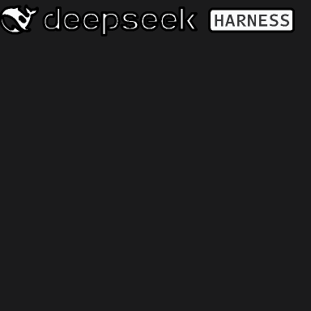

# 鸿蒙桌面端适配：Electron 壳 → ArkTS 原生壳

> 上游事实见 [DESKTOP-SHELL-UPSTREAM.md](DESKTOP-SHELL-UPSTREAM.md)，源码快照在 `desktop-upstream/`。
> 结论：**换壳不换核** —— dsh 内核、协议、profile 全部沿用；把 Electron 提供的那层「窗口/菜单/托盘/更新/对话框」用 ArkTS 重写到鸿蒙原生。

## 为什么不能直接把 Electron 壳搬过来

| 硬约束 | 实据 | 结论 |
|---|---|---|
| 官方发布目标只有 mac/win | `apps/desktop/README.zh.md`：「Linux 不是受支持的 Desktop 发布目标」 | Linux 都没有，鸿蒙更没有 |
| Electron 需要 Chromium + 原生 .node 模块 | 本仓库《限制》章节：鸿蒙禁 dlopen 非受信 ELF，无 openharmony-arm64 预编译包 | Electron 本体、`electron-updater`、`koffi`、`node-pty` 全部不可用 |
| 应用内不能拉起独立可执行文件 | 本仓库既有结论（PCL-HM 打包记录）：`childProcessManager` 只能 fork 自身 ArkTS 运行时，不能跑 node | 壳**不能**像上游那样自己 `spawn` dsh Host；dsh 仍在终端/HNP 侧常驻（默认 3080） |
| `desktop` profile 被 Electron 独占 | dsh `lib/bin.js`：`profile "desktop" is managed exclusively by the Electron application` | 鸿蒙壳不复用该 profile；继续用本仓库既有 profile（web/自定义） |

## 能力映射（逐条对照上游）

| 上游（Electron） | 鸿蒙实现 | 落地位置 | 状态 |
|---|---|---|---|
| `new BrowserWindow({1280,820,min 520x600})` | `setWindowLimits(min/max)` + `resize()` + `moveWindowTo()`（**调用时把 vp 换算成 px**，见下节） + 几何记忆并夹回屏内 | `entryability/EntryAbility.ets`、`desktop/WindowGeometry.ets` | ✅ 已实现 |
| 窗口几何持久化（Electron 自管） | `DesktopPrefs` 存 `window_geometry`（**vp，带 `v` 格式版本**），尺寸变化 400 ms 合并落盘 | `entryability/EntryAbility.ets`、`desktop/DesktopPrefs.ets` | ✅ 已实现 |
| 应用菜单（`Menu.setApplicationMenu`） | 自绘菜单栏 + 下拉层，结构与顺序取自契约 JSON | `view/DesktopMenuBar.ets` | ✅ 已实现 |
| 关于面板（`role:'about'` / Windows 自绘） | 自绘「关于」面板：客户端版本、适配基线、上游提交、Host 协议版本、契约来源 | `view/DesktopDialogs.ets` | ✅ 已实现 |
| 关闭进托盘 + 首次确认（`background-notice`） | `windowStage.on('windowStageClose')` 拦截 → 页面确认 → `terminateSelf()`；无托盘则「最小化」 | `entryability/EntryAbility.ets`、`view/DesktopDialogs.ets` | ✅ 已实现 |
| 退出前任务巡检（`quit-inspection.ts`，2000 ms 超时） | 用流式状态判断「有任务在跑」，确认框文案区分「任务中断 / 定时任务不跑」（沿用上游原文） | `pages/Index.ets` | ⚠️ 等价但更粗（无 Host 巡检 RPC） |
| 原生目录对话框（`dialog.showOpenDialog`） | `DocumentViewPicker` + `DocumentSelectMode.FOLDER`，并发请求合并成一次 | `desktop/DesktopDirectoryPicker.ets` | ✅ 已实现 |
| 设备级快捷键偏好（`keybindings.json`，原子写 0600） | `preferences` 存 `shortcuts`（带 revision 的单写者快照） | `desktop/ShortcutRegistry.ets`、`desktop/DesktopPrefs.ets` | ✅ 已实现 |
| 应用级快捷键（`accelerator`） | `keyboardShortcut()`：Ctrl+W 关闭确认、Ctrl+R 重连、F11 全屏 | `pages/Index.ets` | ✅ 已实现（功能键须走 `FunctionKey` 枚举） |
| 编辑菜单注入按键（`sendEditingKey`） | **不做**：鸿蒙文本组件自管编辑历史，壳无法注入按键；菜单保留条目并提示走系统快捷键 | `pages/Index.ets` | ⚠️ 有意降级（已写进限制） |
| 自更新（`electron-updater` + 签名安装器） | 读同一份 feed 判断「上游是否已发布新版本」，安装引导到官网/应用市场 | `service/DesktopUpdateService.ets`、`desktop/UpdateFeed.ets`、`desktop/UpdateSchedule.ets` | ⚠️ 只做「发现」不做「安装」 |
| 更新轮询策略（10 min / 封顶 1 h / ±20% 抖动 / 手动合并） | 逐条照搬，同样 completion-based 调度 | `desktop/UpdateSchedule.ets` | ✅ 已实现 |
| 强制更新策略、飞书策略登录、崩溃报告、安装器 | **不移植**：依赖 Electron/AGC 侧能力，且本机无对应基础设施 | — | ❌ 明确不做 |
| 打包 Web 页面 + HTTP 转发认证（`dsh-app://` + cookie） | 不用 Web 壳：本仓库客户端走原生 RPC（`/api/<method>` + `events.mux`），无需转发层 | `service/DshApiClient.ets` | ✅ 既定路线（更省资源） |
| 托盘（回窗 / 退出） | 无托盘概念 → 最小化 + 关闭确认；通知栏提醒为后续可选项 | `pages/Index.ets` | ⚠️ 降级 |

## 「单一事实来源」的做法

上游把这些常量写死在 TS 里；鸿蒙侧改为一份可被外部校验的契约：

- `client/entry/src/main/resources/rawfile/desktop-shell.json`：上游仓库/提交/版本、窗口几何、更新调度与 feed 布局、菜单树、快捷键表。
- `client/entry/src/main/ets/desktop/DesktopShellContract.ets`：运行时读取该 JSON（读取失败回落内置默认值并记录原因，**不静默降级到 0 值**）。
- `scripts/desktop-shell-check.mjs`：用 Node 把三方对起来 —— ①契约 ②上游源码快照（正则抠常量）③ArkTS 实现（文案表字段、标签解析 case、菜单分发分支、**窗口几何单位：`resize/moveWindowTo` 必须过 `pxFromVp()`、落盘必须带 `v` 版本号、px/vp 换算只许出现在 `WindowGeometry` 内**），任何一处漂移即失败。当前 29 项全绿。

```sh
node scripts/desktop-shell-check.mjs
```

## UI 复刻：令牌与图标都是「生成物」，不是手写物

界面不许闭门造车，所以视觉真源同样只认上游开源代码，且**不手工誊抄**：

```sh
node scripts/gen-harmony-ui-assets.mjs            # 生成（覆盖写入下面 5 个文件）
node scripts/gen-harmony-ui-assets.mjs --check    # 校验磁盘与生成结果一致（回归/CI）
node scripts/gen-harmony-ui-assets.mjs --upstream ~/dsh-desktop-src/deepseek-harness-master
```

| 上游文件 | 生成物 | 说明 |
| --- | --- | --- |
| `packages/client/ui-theme/src/styles/design-platform.css` | `client/entry/src/main/ets/common/Tokens.ets` | 181 项 `--dsw-*` 令牌，浅色（`body`）与深色（`body[data-ds-dark-theme]`）各一套；生成时递归解析 `var()` 与 `color-mix(in srgb)`，运行时零解析 |
| `packages/client/ui-primitives/src/icons/{index,shared-artwork,PermissionIcon}.tsx` | `client/entry/src/main/ets/common/Icons.ets` | 94 个字形 → `Shape` + `Path.commands`（视口缩放 ⇒ 运行时上色、跟随深浅色），含 `ICON_NAMES`；权限三枚（`PermissionIcon{ReadOnly,WorkspaceWrite,FullAccess}`）从上游 `PermissionIcon.tsx` 的 `*Artwork` 抠出，16×16 视口；不再用只能静态着色的 `Image($r('app.media.*'))`。填色字形**一律带 `strokeWidth(0)`**（关掉 ArkUI 固定加在 `Path` 上的第二遍默认黑描边，见《字形绘制：ArkUI 会给每个 Path 描两遍边》），描边字形带 `strokeWidth($$.strokeWidth ?? 1)` |
| `packages/client/ui-primitives/src/BrandWordmark.tsx` | 同上（`IconBrandWordmark` + `IconBrandFull`） | 生成器 `parseBrandParts()` 一次解析出**两个** @Builder：`IconBrandWordmark` = **只取 `includeMark={false}` 那半张**（viewBox `26 0 156 24`，剥掉带 `dsh-wordmark-whale-clip` 的鲸鱼组，只留「DeepSeek HARNESS」+ HARNESS 反色徽章，`alt` 取 `--dsw-alias-label-primary-inverted`）；`IconBrandFull` = 整幅（viewBox `0 0 182 24`，鲸鱼 + 字标一体，上游预平移好的坐标直接可用）。**品牌排必须用单幅 `IconBrandFull`** —— 早先「取 182 宽字标 + 另画 `FishMark`」会把同一头鲸鱼画两遍（2026-09-26 主人报的「logo 重影」）；折叠轨道只画鲸鱼，用 `FishMark` 是对的（`Brand.ets` 里 `FishMark` 仍保留） |
| `apps/desktop/resources/icon-windows.svg` | `entry/.../media/{icon,startIcon}.svg` + `AppScope/.../media/app_icon.svg` | 应用/入口/启动图统一为官方图标；生成时①剥 `filter` ②`linearGradient` 折成取各 stop 中值的实色 ③`transform` 烘焙进坐标（ArkUI 的 SVG 解析对这三样都不保证） |

尺寸与节奏常量（不属于生成物，但同样逐条有出处）集中在 `client/entry/src/main/ets/common/Theme.ets`：
`ui-theme/src/styles/base.css` 的圆角/动效/字体栈、`apps/desktop/src/windows-layout.ts` 的标题栏 40、
`ui-layout/src/client/columns.ts` 的侧栏 280/56 与正文列宽，以及各组件的 `*.module.css`（会话头 76、输入卡圆角 28、
气泡 20、会话行 32、设置面板 800×800…）。注释里写明了每一组的出处，改动前先回去看上游。

**深浅色/字号的生效链路**（ArkUI 的坑）：`Theme.palette()` 直接读 `AppStorage` **不会**建立渲染依赖，
所以每个组件都声明 `@StorageProp('dshDarkTheme') dark` 并调用 `Theme.palette(this.dark)`（构造参数即订阅），
页面另用 `@State dark`；写侧只有 `Index.applyAppearance()`（`AppStorage.setOrCreate`），
系统深浅色变化由 `EntryAbility.onConfigurationUpdate` → eventHub 触发重算。

## 首页会话入口：工作区 / 工作区权限 / 对话模式（2026-09-26，同日第二轮改为输入行并排）

上游把这三个选择器都挂在 **hero（空会话）相位**，且**共用同一张输入卡**（`ConversationContent.tsx`：
`composerStack` = HeroShell + `heroWorkspaceRow` + 输入卡，输入卡由 `conversation.composer.bar` 槽位**常驻**渲染一次）。
鸿蒙端的等价物逐条对齐如下（真源：`ui-conversation/src/client/skeleton/{ConversationContent,InputBar,EmptyHero}.tsx`、
`ui-conversation/src/client/skeleton/ConversationRoot.module.css` 的 `.composerHero`/`.heroWorkspaceRow`）。
**注意**：第二轮主人要求「工作区选择与对话模式选择放在工作区权限旁边」，所以现在三枚胶囊**并排在输入卡工具排里**，
hero 相位的 `heroWorkspaceRow` 已删除（详见下面《输入行四枚胶囊》一节）：

| 上游座位 | 鸿蒙实现 | 落地位置 |
| --- | --- | --- |
| `heroWorkspaceRow` 的 `WorkspaceChip`（文件夹字形 + 目录名 + chevron，未选时闭文件夹 + 「选择工作区」） | 工作区胶囊：`bindMenu` 列出会话 `cwd`（✓ 标当前）+「选择文件夹…」→ `DocumentViewPicker`；标签 = 手选目录优先，否则当前会话 `cwd` 的末段 | `view/InputBar.ets` 的 `workspaceChip()` / `workspaceMenu()` / `basenameOf()`、`pages/Index.ets` 的 `pickWorkspace()` / `pickWorkspaceDirectory()` |
| `conversation.input.permission`（`ui-permission-presets` 的 `PermissionSelect`） | 输入卡工具排的权限胶囊：权限字形 + 显示名（+ `auto` 档的 `EXP` 上标）+ chevron；菜单取自 `permissionPresets/catalog`，写入走 `commands/execute` 的 `/permission <preset>`；`danger-full-access` / `auto` 先过风险确认（上游 `RiskConfirmation`） | `view/InputBar.ets` 的 `permissionChip()` / `permissionMenu()`、`view/DesktopDialogs.ets` 的 `DesktopPermissionRiskPanel`、`pages/Index.ets` 的 `pickPermission()` / `commitPermission()` |
| `conversation.hero.agentPreset`（`ui-agent-preset` 的 `AgentPresetSeat`，首个回合后锁定） | 对话模式胶囊：dsh 服务模式下列 `agentPresets/list`（剔除 `broken`），选中即暂存给下一个新建会话（`session/create` 的 `agentPreset` 入参）；**独立模式下列内置 `rawfile/presets.json` 的 8 套模式**（选中即成为请求的 system 提示）；会话已有消息时菜单只显示「对话已开始，模式不可更改」 | `view/InputBar.ets` 的 `presetChip()` / `presetMenu()` / `presetText()`、`pages/Index.ets` 的 `pickPreset()` / `loadPresets()` / `applyBundledPresets()` |

本轮修掉的三个问题（对应主人反馈「首页有两个对话输入口 / 没有工作区选择按钮 / 没有工作区权限与对话模式选择」）：

1. **两个输入卡**：原实现 hero 相位渲染了一张 `InputBar`，列尾又常驻一张 → 空会话时同屏两张。按上游语义改为**全列唯一实例**：hero 相位 = hero chrome + 卡（工作区/对话模式两枚已在第二轮搬进卡内工具排），有消息 = 正文 + 同一张卡。全客户端只剩一处 `TextArea`（`view/InputBar.ets`）。
2. **工作区按钮**：原来只有一枚调 `pickWorkspaceDirectory()` 的死按钮；现在是胶囊 + 菜单（会话 `cwd` 候选 + 手选目录），标签与上游 `workspaceLabel` 同规则（目录末段）。
3. **工作区权限 / 对话模式**：原来只是一段被动文本；现在都是真选择器。权限显示名走 `Constants.permissionLabel()`（上游 `displayPermissionPreset`）：`read-only`→仅可查看、`workspace-write`→工作区内修改、`danger-full-access`→完全权限、`auto`→`Auto review`+`EXP`；其余部署名按上游 `displayPresetName` 转 Title Case。**机器值仍用于菜单比对与写入**（显示名绝不回写协议）。

协议侧（0.1.6 typert gateway，本机实测）：

- 单次 RPC：`POST /api/<ns>/<method>`，body `{type:'client-request',rpcId,method,payload:{args:{…}}}`；参数名由描述符决定（`session/list` 要 `_request:{}`，`session/create|prompt|…` 要 `request:{…}`，`agentPresets/list`、`permissionPresets/catalog` 无参）。
- 认证：`GET /`（回环）→ 303 + `set-cookie: dsh-auth-*`（30 天），之后 RPC 与 WebSocket 握手都带 cookie，否则 401（客户端落盘这枚 cookie 并自动重登一次）。
  **坑（2026-09-26 修的就是它）**：`@ohos.net.http` 默认跟随重定向，跟随后那次响应里**没有** `set-cookie`，
  于是 cookie 永远拿不到、所有 RPC 401 —— 用户视角就是「连不上服务」。`DshApiClient.login()` 必须传 `maxRedirects: 0`
  （API 23+；本 SDK **没有** `followRedirects`，写了直接编译报错），并用大小写不敏感的 `headerValue()` 取
  `set-cookie`、`resp.cookies` 兜底。curl 复核：303+cookie → 带 cookie `POST /api/session/list` 200 → `ws://…/api/remote.mux` 握手 101。
- 模型目录 / 选择：`session/modelCatalog`（`{default,routableProviders,groups}`）给候选；`session/selectModel`
  （`{request:{sessionId,provider,model,reasoningEffort}}`）切模型；效果从 `session/list` 的 `modelSelection` 投影读回。
- 会话流：`ws://host/api/remote.mux`，发 `{type:'open',streamId,endpoint:'session/follow',payload:{args:{request:{address:{kind:'session',sessionId},maxMessages:200,assistantStream:true}}}}`；下行 `item` 帧分 `snapshot`（records + 投影 `title`/`permissions`）、`event`（durable，事件名与旧 SSE 一致）、`assistant-stream`（`frame.chunk.type` = `text-delta` / `reasoning-delta`）。旧版 `/api/events.mux`（SSE）与 `agentPreset.list`/`host.describe` 已下线，旧调用全部换掉。
- 权限写入：`commands/execute` 的 `{agentId: sessionId, line:'/permission <preset>', submittedAttachments:[]}`；随后 `session/list` 的 `projections.values.permissions.currentValue` 变为新值（`permissionPresets/catalog` 实测三档：read-only / workspace-write / danger-full-access）。
- 独立模式（客户端内置 DeepSeek API）没有工作区/权限概念：权限胶囊**置灰并给出原因**（不隐藏入口），工作区/对话模式菜单顶部加一行禁用说明，三个菜单里都放一条可点的「切换到 dsh 服务模式…」（= 设置里的连接模式切换，切完自动重连），别让主人停在死路上。

### 独立模式：开箱即用（内置对话模式 + 系统提示）

主人原话是「这个桌面端还是要连本地服务但是连不上，你要么就直接做一套把全部环境融合进去开箱即用的」。
本轮把「必须连本地服务」这条硬依赖砍掉：

- **对话模式随包分发**：`scripts/gen-client-presets.mjs`（零依赖，支持 `--check`）把仓库
  `presets/*/{preset.yml,agent.cordis.yml}` 生成成 `client/entry/src/main/resources/rawfile/presets.json`
  （id / 中文产品名 / 说明 / persona 系统提示，8 套）；`common/PresetCatalog.ets` 读取
  （`getRawFileContentSync` + `util.TextDecoder`），**读不到就回落 `Constants.BUILTIN_PRESETS` 的 id 列表** ——
  列表仍可切换，只是没有中文名与提示，绝不阻塞启动。
- **模式即系统提示**：独立模式下每次请求把所选模式的 persona 作为 `messages[0]`（`role:'system'`）发出
  （`DeepSeekClient.chat()` 末位 `systemPrompt` 参数），`{{model}}`/`{{cwd}}` 占位替换成当前模型与工作目录
  （`PresetCatalog.systemPrompt()`）。这就是「对话模式」在没有服务端 agent 时的真实语义。
- **端点可配**：`Constants.KEY_DIRECT_BASE_URL` / `DIRECT_BASE_URL='https://api.deepseek.com/v1'` 只是默认值；
  设置面板里能改（OpenAI 兼容端点，`DeepSeekClient.setEndpoint()`：空串 → 官方、只给主机名 → 自动补 `/v1`、给了路径 → 补 `/chat/completions`）。
  API Key / 模型 / 接口地址三者只存本机 preferences，不经服务端。
- **不调服务端的部分**：独立模式下 `agentPresets/list` 不调用；`loadPresets()` 变成「**先内置、后服务**」——
  内置永远可用，连上服务端后用 `agentPresets/list` 覆盖，并用服务端 name 补上中文名缺失的那些。
- 文案统一为「独立模式（内置，开箱即用）」/「dsh 服务模式」（设置面板的 Select 与说明行）。

### 输入行四枚胶囊（工作区 / 工作区权限 / 对话模式并排）

上游把「工作区」「对话模式」放在 hero 相位输入卡**上方**的 `heroWorkspaceRow`，与卡内的「工作区权限」分处两行；
主人要求三枚并排，于是 `view/InputBar.ets` 的工具排改成 **Flex 换行**，一行四枚：

```
+ 圆 → 工作区权限 → 工作区 → 对话模式                  模型胶囊（右侧，真 bindMenu）
```

- 上游座位不变（`conversation.input.{permission,model}` 仍是工具排左右两端），只是把 `heroWorkspaceRow` 的两枚
  **搬进**工具排 —— 这是与上游的**有意差异**，改代码前先读 `view/InputBar.ets` 顶部注释（那里写了原因与来源）。
- **模型胶囊是真菜单**（`conversation.input.model` 座位，语义照上游 `ui-model-selection/src/client/ModelSelect.tsx`）：
  候选打 ✓ 标当前，选中即切；最后一行才是设置入口（独立模式「模型与 API Key…」/ dsh 服务模式「模型与连接设置…」）。
  之前它被误接到 `onOpenModelSettings` 上，**点一下直接开设置**（主人报的 bug），已修。
- 模型候选与切换：独立模式 = 内置模型 id；dsh 服务模式 = `session/modelCatalog` 的 `groups[].models[]` 拼 `provider/model`。
  切换走 `session/selectModel`（`{request:{sessionId,provider,model,reasoningEffort}}`），之后 `session/list` 的
  `projections.values.modelSelection.{lastUsed,next}` 回填当前模型 —— `modelLabel()` 不再拿预设名冒充模型。
- 胶囊不可用时（独立模式 / 未连接 / 还没有会话）统一「**置灰 + 菜单首行写原因 + 末行留切换入口**」，不隐藏、不留死路。

## 构建与验证

```sh
# 用本机 API 26 混合工具链编译（见 ~/bin/deveco-api26.sh 说明）
sh ~/bin/deveco-api26.sh ~/dsh-harmonyos-pc/client assembleHap
# 产物：client/entry/build/default/outputs/default/entry-default-unsigned.hap

# 出「未签名 release HAP」（可直接分发的那个）
cd ~/dsh-harmonyos-pc/client && rm -rf .hvigor entry/build
sh ~/bin/deveco-api26.sh . assembleHap --mode module \
  -p module=entry@default -p requiredDeviceType=2in1 -p product=default -p buildMode=release
# 产物：entry/build/default/outputs/default/entry-default-unsigned.hap
#       742,569 B / ets/modules.abc 687,544 B（字形 strokeWidth(0) 消重影那一轮）
#       （HAP 是 zip，包内文件带 mtime ⇒ 同一份源码两次构建 sha256 不同；体积与 `ets/modules.abc` 字节数才是可比对量）
# 副本：client/dist/dsh-harmonyos-client-1.0.0-release-unsigned.hap（与 ~/Download/ 各一份）
```

- 现状：**编译通过**，产出未签名 HAP（本机无签名配置 → 不能 `hdc install`；真机安装需 DevEco 配好签名/Provision Profile）。
- 为什么天然未签名：`client/build-profile.json5` 的 `signingConfigs` 是空数组，hvigor 到 `SignHap` 阶段只打印 `WARN: No signingConfig found for product default` 就跳过 —— 包内没有 `META-INF/`、没有证书与 profile。要签名只需往 `signingConfigs` 填 DevEco 生成的证书 + profile。
- 体积：release **742,569 B**（`ets/modules.abc` **687,544 B** + 三份 4,047 B 的官方图标 + 契约 + 内置对话模式表 `rawfile/presets.json` + `pack.info`）。比 UI 复刻前的 284,192 B 大，全部来自新增的令牌表、94 个字形、官方 1024 图标的矢量数据与内置预设提示（release 仍开 `obfuscation`，包内无 sourcemap）。sha256 `4a982689f659f8c907e4cb7fc81b455d39d649f7e3a44b3408d9566e4f5605e3`（`client/dist/` 与 `~/Download/` 一致）。
- 包内容（release，11 项）：`module.json`、`resources.index`、`resources/base/media/{app_icon,icon,startIcon}.svg`、`resources/base/profile/main_pages.json`、`resources/rawfile/desktop-shell.json`、**`resources/rawfile/presets.json`**、`ets/modules.abc`、`pack.info`、`pkgSdkInfo.json`。
- 已验证：ArkTS 编译零错误（仅剩 1 条无害 WARN：`startMoving` 起于 API 14，已用 `deviceInfo.sdkApiVersion` 门控）；`desktop-shell-check.mjs` **32/32**（含单位防回归：把 `resize()` 的实参改回裸 vp 值后脚本 exit 1 并能逐条指认，改回即恢复全绿；另含 3 项「每个 Path 必须显式 strokeWidth」的消重影防回归）；`gen-harmony-ui-assets.mjs --check` 五份生成物与磁盘一致（令牌 181 · 字形 94）；`gen-client-presets.mjs --check` 通过（`rawfile/presets.json` 与 `presets/` 一致，8 套模式）；契约负向测试（改坏 `defaultWidth` → 脚本 exit 1 且精确指认）；应用图标用自写的 `scripts/svg-preview.py`（纯标准库光栅化，`python3 scripts/svg-preview.py <in.svg> <out.png> [尺寸] [--bg #RRGGBB] [--scale S] [--pen W]`）渲染核对过几何——鲸鱼路径 `x 150.138..910.32 / y 260.291..819.325` 与上游 bbox 经同一线性映射后的结果逐位相同；`IconBrandWordmark` 的字标墨迹实测 `x 26.96..181.35 / y 4.63..21.64`（= 上游 `includeMark=false` 的 `26 0 156 24` 视口）；包内 `ets/modules.abc` 抽查含 `IconBrandFull` 的鲸鱼路径（`M23.0584 4.95203`，1 次）、`PresetCatalog`、`session/selectModel`、`maxRedirects`，并用 `ark_disasm` 反汇编确认 `strokeWidth(0)` 调用点 **87 处**（85 个填充字形 + `FishMark` + 发送箭头）——ABC 里是 `ldobjbyname "strokeWidth"` + `ldai 0x0` + `callthis1`，不是字符串，别再用 `grep strokeWidth(0)` 查包。
- 链路实测（curl，本机）：`GET /` → 303 + `set-cookie: dsh-auth-*`；带该 cookie `POST /api/session/list` → 200；`ws://127.0.0.1:3080/api/remote.mux` 握手 → **101**。
- 未验证：真机 UI 行为（无在线设备，`hdc list targets` 为空）。所有窗口/选择器/更新调用都写了 try-catch 与失败提示，不会把异常抛到 UI 线程。

## 字形绘制：ArkUI 会给**每个** `Path` 描两遍边（左上角 logo「重影」的真因）

主人 2026-09-26 报的「左上角 deepseekharness logo 还是重影不清晰」，真因不在品牌几何（几何逐字节来自上游
`BrandWordmark.tsx`），而在 ArkUI 的绘制语义：

```cpp
// frameworks/core/components_ng/pattern/shape/drawing_painter.cpp
void DrawingPainter::DrawPath(RSCanvas& canvas, const std::string& commands, const ShapePaintProperty& p) {
    // do brush first then do pen
    SetBrush(brush, p); canvas.AttachBrush(brush); canvas.DrawPath(path); canvas.DetachBrush();
    if (SetPen(pen, p)) { canvas.AttachPen(pen); canvas.DrawPath(path); canvas.DetachPen(); }   // ← 第二遍
}
bool DrawingPainter::SetPen(RSPen& pen, const ShapePaintProperty& p) {
    if (p.HasStrokeWidth()) { if (NearZero(p.GetStrokeWidth()->Value())) return false; ... }
    else { pen.SetWidth(p.STROKE_WIDTH_DEFAULT.ConvertToPx()); }        // = 1.0_vp
    ...
    Color strokeColor = p.GetStrokeValue(Color::BLACK);                 // 缺省 = 不透明黑
    ...
    return true;
}
```

**结论**：只要一个 `Path` 没写 `strokeWidth`，ArkUI 就**先用 brush 填色、再用默认黑 pen 描一遍边** —— 同一个字形
被画两次、外面再套一圈 1vp 黑描边。字号越小越致命（品牌字标只有 30vp 高、"deepseek" 笔画约 2 个 viewBox 单位宽，
1vp 黑描边就吃掉近一半笔宽），观感就是**重影 + 发虚**。描边字形（上游 outline 图标）本来就显式 `strokeWidth`，
所以受损的只有填充字形：品牌字标（最显眼）、HARNESS 反色徽章里的字、发送箭头、少数实心图标。

**修法**（不是「把描边调细」，是**关掉第二遍绘制**）：

| 位置 | 改法 |
| --- | --- |
| `scripts/gen-harmony-ui-assets.mjs` | `emitIcons` 的填充分支 + `emitBrand`/`emitBrandFull` 的每个 `Path` 一律补 `.strokeWidth(0)`（`NearZero` ⇒ `SetPen()` 返回 false ⇒ 只画填色那一遍） |
| `common/Brand.ets`（手写） | `FishMark` 的 `Path` 补 `.strokeWidth(0)` |
| `view/InputBar.ets`（手写） | 发送箭头的 `Path` 补 `.strokeWidth(0)` |
| `scripts/desktop-shell-check.mjs` | 新增 3 项防回归：`Icons.ets` 里 `.commands(` 数必须等于 `.strokeWidth(` 数；`Brand.ets`/`InputBar.ets` 每个 `.fill(` 的表达式链里必须有 `.strokeWidth` |

**自查手段**：`scripts/svg-preview.py` 新增 `--scale S`（放大看细节）与 `--pen W --pen-color`（`W` 以 viewBox 单位计，
模拟 ArkUI 的默认黑 pen 第二遍绘制）。同一份官方几何，两种渲染：




左（现在）：单遍填色，笔画干净；右（修前）：每个笔画被黑 pen 再描一圈，细看就是「重影」。
包内核对：把 `ets/modules.abc` 解出来 `ark_disasm` 成 `.pa` 后，`strokeWidth` 的调用点里**传 0 的有 87 处**
（85 个填充字形 + `FishMark` + 发送箭头），与源码一一对应。

## 窗口几何：px 还是 vp（踩过的坑，别再来一次）

官方把两套单位放在同一个命名空间里，写错**照样能编译、照样有返回值**，只是结果全错：

| 官方 API / 类型 | 单位 | 出处 |
| --- | --- | --- |
| `resize(width, height)` / `resizeAsync()` | **px** | `arkts-apis-window-Window.md#resize9`：`New width of the window, in px` |
| `moveWindowTo(x, y)` / `moveWindowToAsync()` | **px** | 同文件 `#movewindowto9` |
| `getWindowProperties().windowRect` / `getLastWindowRect()` / `Rect` | **px** | `arkts-apis-window-i.md#rect7` |
| `on('windowSizeChange')` 回调的 `Size` | **px** | `arkts-apis-window-i.md#size7` |
| `WindowLimits` 的 min/maxWidth/maxHeight | **px** | `arkts-apis-window-i.md#windowlimits11`；《应用适配自由窗口》亦写「默认单位为 px」 |
| `RectInVP` / `SizeInVP` / `getWindowLimitsVP()` / `PixelUnit.VP` | vp | **API 22/23 才新增**，本工程不用（走 px 那套） |
| `Display.densityPixels` | px/vp 系数 | 唯一的换算依据（`px = vp * density`） |

工程约定（与 `client/entry/src/main/ets/desktop/WindowGeometry.ets` 顶部注释保持一致，改代码前先读那一段）：

- 内部（内存字段、落盘、夹取、与显示器可视区比较）**一律 vp**，与上游 Electron 的 CSS px 等价；
- 每次 `mainWindow.resize()/moveWindowTo()` 都必须经 `WindowGeometry.pxFromVp(vp, density)`；
- 每次读 `windowRect` 落盘都必须经 `vpFromPx()`（`fromPixelRect()` 一次转四个字段）；
- 落盘 JSON 带 `"v":2`：单位混用期写下的脏数据（px 值当 vp 存）**整条丢弃**回默认几何，不靠夹取兜底。

**症状对照**（2026-09-26 修的就是这条）：值按 vp 存、又按 vp 传给 px API ⇒ 每次重启窗口都被 `density` 折半，
再被 `setWindowLimits()` 的最小尺寸夹住，两三次启动后**永久停在 520x600**；从用户视角看只是「窗口拖不小」，
位置还会一轮一轮往左上角漂（`moveWindowTo()` 同样被砍半）。

## 权限变更（必须知道）

`module.json5` 新增 `definePermissions` 声明 `ohos.permission.USE_AI`（`system_grant` / `system_basic`）。
原因：HarmonyOS 26(API 26) SDK 的预定义权限表里没有 `USE_AI`，构建器 `PreBuild` 直接报
`00303221 Configuration Error`；显式声明后构建通过，语义与官方定义一致。
**注意**：该权限仍需 `system_basic` APL 的签名模板才会真正授予（见 [LOCAL-AI-USE_AI.md](LOCAL-AI-USE_AI.md)），
未签名/普通 APL 构建下声明存在但不会生效。

## 已知限制（与上游行为不同之处，均为有意选择）

1. **应用内更新安装**：鸿蒙端不做。dsh 桌面更新包是 Electron 制品，装不上；本壳只提示「上游有新版本」。
2. **编辑菜单**：撤销/重做/剪切/复制/粘贴/全选由系统文本组件处理，壳的菜单项只保留入口与提示。
3. **托盘**：鸿蒙无托盘，'隐藏应用' 类动作落到「最小化窗口」。
4. **`restartAppHost`（重启应用与 Host）**：dsh 不在应用进程内，壳无权重启，改为提示到终端重启。
5. **强制更新/策略登录/崩溃报告**：不移植（依赖 Electron 与 AGC 侧设施）。
6. **UI 只看得到代码，没看到真机**：`hdc list targets` 为空、SDK 里只有 Windows 版 Previewer，所以这一轮 UI 复刻是「按上游 CSS/TSX 的数值逐条对齐 + 编译通过」，没有截图比对。视觉上仍可能有偏差的地方集中在 ArkUI 与浏览器语义不同的部分：`filter` 投影（已剥离）、SVG 渐变（已折实色）、`border: 0.5px` 发丝线、`backgroundBlurStyle` 毛玻璃、`Shape.viewPort` 缩放的描边粗细。真机在手时优先核这几处。
7. **上游部分视觉能力没有等价物**：Electron 的窗口 vibrancy（macOS 半透明侧栏）、原生 caption 菜单（我们用自绘三键）、`-webkit-app-region: drag`（我们用 `startMoving()`，起于 API 14，低版本回退系统标题栏）。另外折叠轨道里上游的「会话列表 / 搜索」面板本端尚未接入，轨道只保留「展开侧栏」与「设置」两个真实入口，不做点了没反应的假按钮。
8. **自绘标题栏必须连系统三键一起隐藏**：`setWindowDecorVisible(false)` 只藏标题栏本体，系统三键（右上角最大化/最小化/关闭）仍在，且**压在自绘标题栏上层** —— 点过去命中的是系统按钮。所以 `EntryAbility.applyDesktopWindow()` 里必须同时调 `setWindowTitleButtonVisible(false, false, false)`，三键由 `view/DesktopMenuBar.ets` 自绘（几何与 hover 色照上游 Windows 标题栏）；`setWindowDecorHeight(40)` 只是让系统知道标题栏高度（与自绘栏对齐，合法区间 [37,112] vp）。
